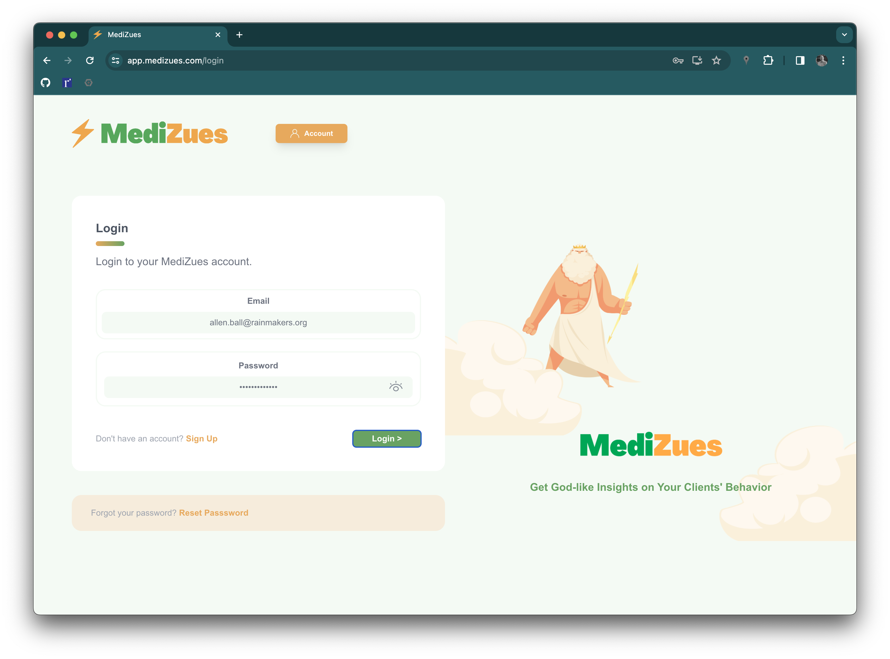
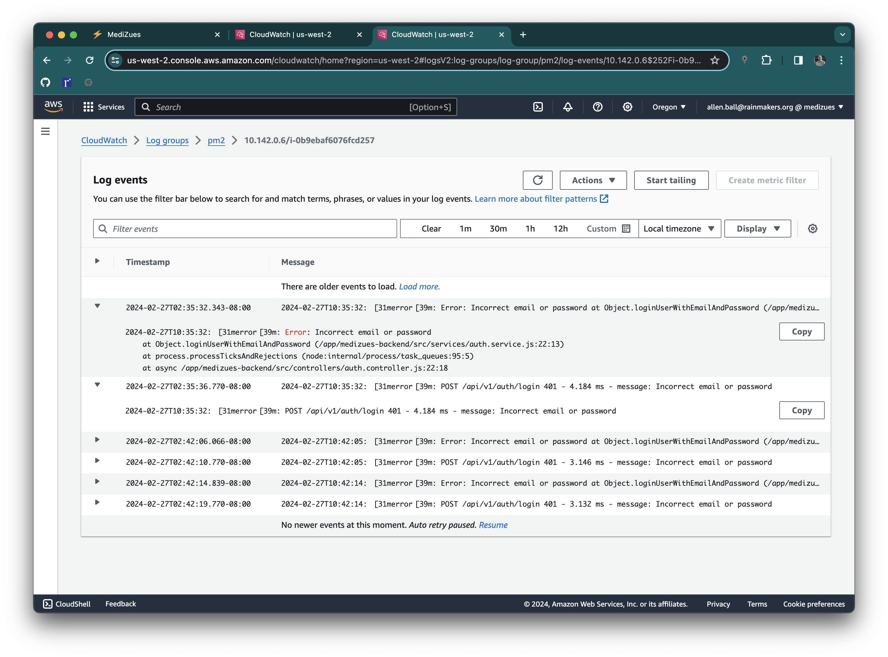

# Application Access Request Denied Log

~~~admonish info
This document provides the screenshots of the corresponding log entries from a
known denied login attempt.
~~~

Medizues Login Screen (with invalid username and password):

Errors for the event are recorded in the `nginx/access.log` CloudWatch logs:

And further detail for the same events are included in the `pm2` logs:

