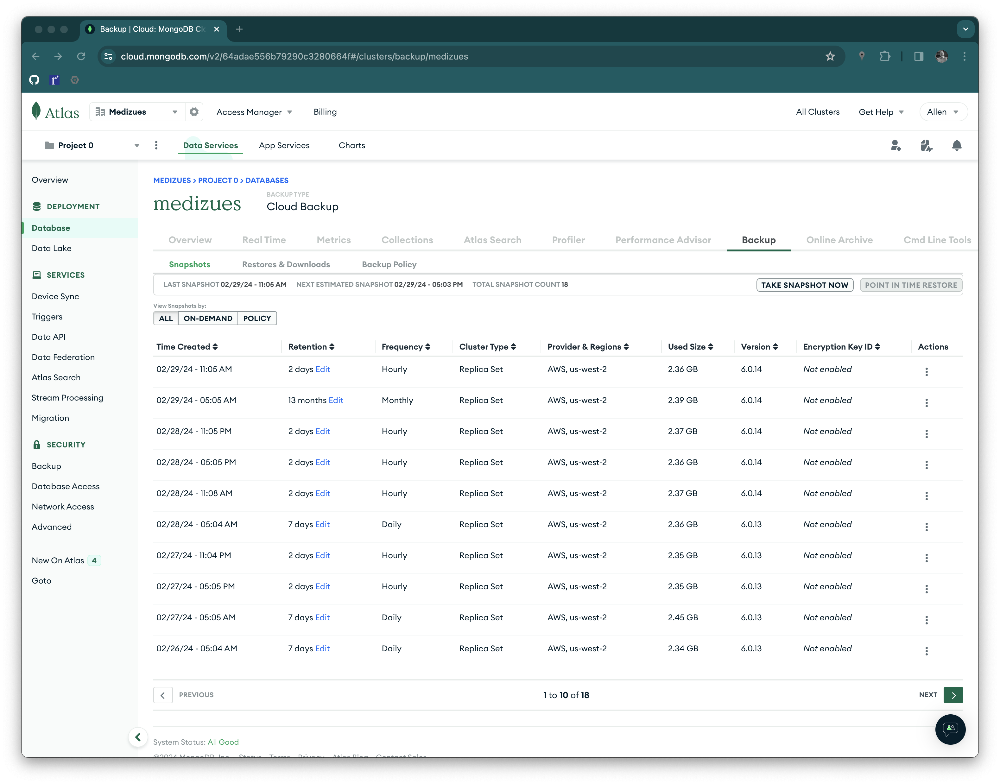

# Data Restore Test

~~~admonish info
This documents describes the annual Atlas Mongo back-up restore test.
~~~

The MediZues application database is MongoDB hosted by Atlas.  The following
steps were executed to verify Atlas' periodic back-ups.

1. Set-up an Ubuntu 20.04 Mongo 6.0 server for testing (10.143.0.24)

2. Download last back-up from
   <https://cloud.mongodb.com/v2/64adae556b79290c3280664f#/clusters/backup/medizues>



```bash
$ ssh 10.143.0.24
Last login: Thu Feb 29 22:23:05 2024 from 10.4.0.4
ubuntu@ip-10-143-0-24:~$ ls -l
total 226820
-rw-r--r-- 1 ubuntu ubuntu 232261161 Feb 29 22:19 restore-65e0d50a98aae91f0e2bd867.tar.gz
```

3. Expand the TAR archive, set the access, and start a Mongo instance.

```bash
ubuntu@ip-10-143-0-24:~$ tar xzf restore-65e0d50a98aae91f0e2bd867.tar.gz
ubuntu@ip-10-143-0-24:~$ sudo chown -R mongodb:mongodb restore-65e0d50a98aae91f0e2bd867
ubuntu@ip-10-143-0-24:~$ sudo -u mongodb mongod --dbpath restore-65e0d50a98aae91f0e2bd867
{"t":{"$date":"2024-02-29T23:20:15.895+00:00"},"s":"I",  "c":"CONTROL",  "id":23285,   "ctx":"-","msg":"Automatically disabling TLS 1.0, to force-enable TLS 1.0 specify --sslDisabledProtocols 'none'"}
{"t":{"$date":"2024-02-29T23:20:15.898+00:00"},"s":"I",  "c":"NETWORK",  "id":4915701, "ctx":"main","msg":"Initialized wire specification","attr":{"spec":{"incomingExternalClient":{"minWireVersion":0,"maxWireVersion":17},"incomingInternalClient":{"minWireVersion":0,"maxWireVersion":17},"outgoing":{"minWireVersion":6,"maxWireVersion":17},"isInternalClient":true}}}
{"t":{"$date":"2024-02-29T23:20:15.898+00:00"},"s":"I",  "c":"NETWORK",  "id":4648601, "ctx":"main","msg":"Implicit TCP FastOpen unavailable. If TCP FastOpen is required, set tcpFastOpenServer, tcpFastOpenClient, and tcpFastOpenQueueSize."}
{"t":{"$date":"2024-02-29T23:20:15.899+00:00"},"s":"I",  "c":"REPL",     "id":5123008, "ctx":"main","msg":"Successfully registered PrimaryOnlyService","attr":{"service":"TenantMigrationDonorService","namespace":"config.tenantMigrationDonors"}}
{"t":{"$date":"2024-02-29T23:20:15.899+00:00"},"s":"I",  "c":"REPL",     "id":5123008, "ctx":"main","msg":"Successfully registered PrimaryOnlyService","attr":{"service":"TenantMigrationRecipientService","namespace":"config.tenantMigrationRecipients"}}
{"t":{"$date":"2024-02-29T23:20:15.899+00:00"},"s":"I",  "c":"REPL",     "id":5123008, "ctx":"main","msg":"Successfully registered PrimaryOnlyService","attr":{"service":"ShardSplitDonorService","namespace":"config.tenantSplitDonors"}}
{"t":{"$date":"2024-02-29T23:20:15.899+00:00"},"s":"I",  "c":"CONTROL",  "id":5945603, "ctx":"main","msg":"Multi threading initialized"}
{"t":{"$date":"2024-02-29T23:20:15.900+00:00"},"s":"I",  "c":"CONTROL",  "id":4615611, "ctx":"initandlisten","msg":"MongoDB starting","attr":{"pid":4712,"port":27017,"dbPath":"restore-65e0d50a98aae91f0e2bd867","architecture":"64-bit","host":"ip-10-143-0-24"}}
{"t":{"$date":"2024-02-29T23:20:15.900+00:00"},"s":"I",  "c":"CONTROL",  "id":23403,   "ctx":"initandlisten","msg":"Build Info","attr":{"buildInfo":{"version":"6.0.14","gitVersion":"25225db95574916fecab3af75b184409f8713aef","openSSLVersion":"OpenSSL 1.1.1f  31 Mar 2020","modules":[],"allocator":"tcmalloc","environment":{"distmod":"ubuntu2004","distarch":"x86_64","target_arch":"x86_64"}}}}
{"t":{"$date":"2024-02-29T23:20:15.900+00:00"},"s":"I",  "c":"CONTROL",  "id":51765,   "ctx":"initandlisten","msg":"Operating System","attr":{"os":{"name":"Ubuntu","version":"20.04"}}}
{"t":{"$date":"2024-02-29T23:20:15.900+00:00"},"s":"I",  "c":"CONTROL",  "id":21951,   "ctx":"initandlisten","msg":"Options set by command line","attr":{"options":{"storage":{"dbPath":"restore-65e0d50a98aae91f0e2bd867"}}}}
{"t":{"$date":"2024-02-29T23:20:15.901+00:00"},"s":"I",  "c":"STORAGE",  "id":22297,   "ctx":"initandlisten","msg":"Using the XFS filesystem is strongly recommended with the WiredTiger storage engine. See http://dochub.mongodb.org/core/prodnotes-filesystem","tags":["startupWarnings"]}
{"t":{"$date":"2024-02-29T23:20:15.901+00:00"},"s":"I",  "c":"STORAGE",  "id":22315,   "ctx":"initandlisten","msg":"Opening WiredTiger","attr":{"config":"create,cache_size=1442M,session_max=33000,eviction=(threads_min=4,threads_max=4),config_base=false,statistics=(fast),log=(enabled=true,remove=true,path=journal,compressor=snappy),builtin_extension_config=(zstd=(compression_level=6)),file_manager=(close_idle_time=600,close_scan_interval=10,close_handle_minimum=2000),statistics_log=(wait=0),json_output=(error,message),verbose=[recovery_progress:1,checkpoint_progress:1,compact_progress:1,backup:0,checkpoint:0,compact:0,evict:0,history_store:0,recovery:0,rts:0,salvage:0,tiered:0,timestamp:0,transaction:0,verify:0,log:0],"}}
{"t":{"$date":"2024-02-29T23:20:17.040+00:00"},"s":"I",  "c":"STORAGE",  "id":4795906, "ctx":"initandlisten","msg":"WiredTiger opened","attr":{"durationMillis":1139}}
{"t":{"$date":"2024-02-29T23:20:17.040+00:00"},"s":"I",  "c":"RECOVERY", "id":23987,   "ctx":"initandlisten","msg":"WiredTiger recoveryTimestamp","attr":{"recoveryTimestamp":{"$timestamp":{"t":1709233456,"i":3}}}}
{"t":{"$date":"2024-02-29T23:20:17.040+00:00"},"s":"I",  "c":"RECOVERY", "id":5380106, "ctx":"initandlisten","msg":"WiredTiger oldestTimestamp","attr":{"oldestTimestamp":{"$timestamp":{"t":1709233156,"i":3}}}}
{"t":{"$date":"2024-02-29T23:20:17.057+00:00"},"s":"I",  "c":"STORAGE",  "id":22383,   "ctx":"initandlisten","msg":"The size storer reports that the oplog contains","attr":{"numRecords":2580745,"dataSize":1030991262}}
{"t":{"$date":"2024-02-29T23:20:17.057+00:00"},"s":"I",  "c":"STORAGE",  "id":22386,   "ctx":"initandlisten","msg":"Sampling the oplog to determine where to place markers for truncation"}
{"t":{"$date":"2024-02-29T23:20:17.057+00:00"},"s":"I",  "c":"STORAGE",  "id":22389,   "ctx":"initandlisten","msg":"Sampling from the oplog to determine where to place markers for truncation","attr":{"from":{"$timestamp":{"t":1707147819,"i":17}},"to":{"$timestamp":{"t":1709233516,"i":1}}}}
{"t":{"$date":"2024-02-29T23:20:17.058+00:00"},"s":"I",  "c":"STORAGE",  "id":22390,   "ctx":"initandlisten","msg":"Taking samples and assuming each oplog section contains","attr":{"numSamples":605,"minBytesPerStone":17017872,"containsNumRecords":42599,"containsNumBytes":17018030}}
{"t":{"$date":"2024-02-29T23:20:17.139+00:00"},"s":"I",  "c":"STORAGE",  "id":22393,   "ctx":"initandlisten","msg":"Oplog sampling complete"}
{"t":{"$date":"2024-02-29T23:20:17.139+00:00"},"s":"I",  "c":"STORAGE",  "id":22382,   "ctx":"initandlisten","msg":"WiredTiger record store oplog processing finished","attr":{"durationMillis":82}}
{"t":{"$date":"2024-02-29T23:20:17.230+00:00"},"s":"W",  "c":"CONTROL",  "id":22120,   "ctx":"initandlisten","msg":"Access control is not enabled for the database. Read and write access to data and configuration is unrestricted","tags":["startupWarnings"]}
{"t":{"$date":"2024-02-29T23:20:17.230+00:00"},"s":"W",  "c":"CONTROL",  "id":22140,   "ctx":"initandlisten","msg":"This server is bound to localhost. Remote systems will be unable to connect to this server. Start the server with --bind_ip <address> to specify which IP addresses it should serve responses from, or with --bind_ip_all to bind to all interfaces. If this behavior is desired, start the server with --bind_ip 127.0.0.1 to disable this warning","tags":["startupWarnings"]}
{"t":{"$date":"2024-02-29T23:20:17.231+00:00"},"s":"W",  "c":"CONTROL",  "id":22184,   "ctx":"initandlisten","msg":"Soft rlimits for open file descriptors too low","attr":{"currentValue":1024,"recommendedMinimum":64000},"tags":["startupWarnings"]}
{"t":{"$date":"2024-02-29T23:20:17.255+00:00"},"s":"I",  "c":"NETWORK",  "id":4915702, "ctx":"initandlisten","msg":"Updated wire specification","attr":{"oldSpec":{"incomingExternalClient":{"minWireVersion":0,"maxWireVersion":17},"incomingInternalClient":{"minWireVersion":0,"maxWireVersion":17},"outgoing":{"minWireVersion":6,"maxWireVersion":17},"isInternalClient":true},"newSpec":{"incomingExternalClient":{"minWireVersion":0,"maxWireVersion":17},"incomingInternalClient":{"minWireVersion":17,"maxWireVersion":17},"outgoing":{"minWireVersion":17,"maxWireVersion":17},"isInternalClient":true}}}
{"t":{"$date":"2024-02-29T23:20:17.255+00:00"},"s":"I",  "c":"REPL",     "id":5853300, "ctx":"initandlisten","msg":"current featureCompatibilityVersion value","attr":{"featureCompatibilityVersion":"6.0","context":"startup"}}
{"t":{"$date":"2024-02-29T23:20:17.256+00:00"},"s":"I",  "c":"STORAGE",  "id":5071100, "ctx":"initandlisten","msg":"Clearing temp directory"}
{"t":{"$date":"2024-02-29T23:20:17.256+00:00"},"s":"I",  "c":"STORAGE",  "id":21005,   "ctx":"initandlisten","msg":"Not restarting unfinished index builds because we are in standalone mode"}
{"t":{"$date":"2024-02-29T23:20:17.408+00:00"},"s":"I",  "c":"CONTROL",  "id":20536,   "ctx":"initandlisten","msg":"Flow Control is enabled on this deployment"}
{"t":{"$date":"2024-02-29T23:20:17.408+00:00"},"s":"I",  "c":"STORAGE",  "id":5380103, "ctx":"initandlisten","msg":"Unpin oldest timestamp request","attr":{"service":"_wt_startup","requestedTs":{"$timestamp":{"t":1709233156,"i":3}}}}
{"t":{"$date":"2024-02-29T23:20:17.408+00:00"},"s":"I",  "c":"FTDC",     "id":20625,   "ctx":"initandlisten","msg":"Initializing full-time diagnostic data capture","attr":{"dataDirectory":"restore-65e0d50a98aae91f0e2bd867/diagnostic.data"}}
{"t":{"$date":"2024-02-29T23:20:17.411+00:00"},"s":"I",  "c":"REPL",     "id":6015317, "ctx":"initandlisten","msg":"Setting new configuration state","attr":{"newState":"ConfigReplicationDisabled","oldState":"ConfigPreStart"}}
{"t":{"$date":"2024-02-29T23:20:17.412+00:00"},"s":"W",  "c":"CONTROL",  "id":20547,   "ctx":"initandlisten","msg":"Document(s) exist in 'system.replset', but started without --replSet. Database contents may appear inconsistent with the writes that were visible when this node was running as part of a replica set. Restart with --replSet unless you are doing maintenance and no other clients are connected. The TTL collection monitor will not start because of this. For more info see http://dochub.mongodb.org/core/ttlcollections","tags":["startupWarnings"]}
{"t":{"$date":"2024-02-29T23:20:17.412+00:00"},"s":"I",  "c":"STORAGE",  "id":22262,   "ctx":"initandlisten","msg":"Timestamp monitor starting"}
{"t":{"$date":"2024-02-29T23:20:17.416+00:00"},"s":"I",  "c":"NETWORK",  "id":23015,   "ctx":"listener","msg":"Listening on","attr":{"address":"/tmp/mongodb-27017.sock"}}
{"t":{"$date":"2024-02-29T23:20:17.417+00:00"},"s":"I",  "c":"NETWORK",  "id":23015,   "ctx":"listener","msg":"Listening on","attr":{"address":"127.0.0.1"}}
{"t":{"$date":"2024-02-29T23:20:17.417+00:00"},"s":"I",  "c":"NETWORK",  "id":23016,   "ctx":"listener","msg":"Waiting for connections","attr":{"port":27017,"ssl":"off"}}
{"t":{"$date":"2024-02-29T23:20:17.417+00:00"},"s":"I",  "c":"CONTROL",  "id":8423403, "ctx":"initandlisten","msg":"mongod startup complete","attr":{"Summary of time elapsed":{"Startup from clean shutdown?":true,"Statistics":{"Transport layer setup":"0 ms","Run initial syncer crash recovery":"0 ms","Create storage engine lock file in the data directory":"0 ms","Create storage engine lock file in the data directory":"0 ms","Get metadata describing storage engine":"0 ms","Get metadata describing storage engine":"0 ms","Create storage engine":"0 ms","Create storage engine":"1319 ms","Write current PID to file":"0 ms","Write current PID to file":"0 ms","Write a new metadata for storage engine":"0 ms","Write a new metadata for storage engine":"10 ms","Initialize FCV before rebuilding indexes":"0 ms","Initialize FCV before rebuilding indexes":"24 ms","Drop abandoned idents and get back indexes that need to be rebuilt or builds that need to be restarted":"0 ms","Drop abandoned idents and get back indexes that need to be rebuilt or builds that need to be restarted":"0 ms","Rebuild indexes for collections":"0 ms","Rebuild indexes for collections":"0 ms","Build user and roles graph":"0 ms","Verify indexes for admin.system.users collection":"0 ms","Verify indexes for admin.system.users collection":"0 ms","Verify indexes for admin.system.roles collection":"0 ms","Verify indexes for admin.system.roles collection":"0 ms","Set up the background thread pool responsible for waiting for opTimes to be majority committed":"0 ms","Start up the replication coordinator":"1 ms","Start transport layer":"3 ms","_initAndListen total elapsed time":"1517 ms"}}}}
```

4. Verify data integrity through queries

```bash
ubuntu@ip-10-143-0-24:~$ mongosh
Current Mongosh Log ID:	65e11319e697853ca41b8227
Connecting to:		mongodb://127.0.0.1:27017/?directConnection=true&serverSelectionTimeoutMS=2000&appName=mongosh+2.1.5
Using MongoDB:		6.0.14
Using Mongosh:		2.1.5

For mongosh info see: https://docs.mongodb.com/mongodb-shell/

------
   The server generated these startup warnings when booting
   2024-02-29T23:20:15.901+00:00: Using the XFS filesystem is strongly recommended with the WiredTiger storage engine. See http://dochub.mongodb.org/core/prodnotes-filesystem
   2024-02-29T23:20:17.230+00:00: Access control is not enabled for the database. Read and write access to data and configuration is unrestricted
   2024-02-29T23:20:17.230+00:00: This server is bound to localhost. Remote systems will be unable to connect to this server. Start the server with --bind_ip <address> to specify which IP addresses it should serve responses from, or with --bind_ip_all to bind to all interfaces. If this behavior is desired, start the server with --bind_ip 127.0.0.1 to disable this warning
   2024-02-29T23:20:17.231+00:00: Soft rlimits for open file descriptors too low
   2024-02-29T23:20:17.412+00:00: Document(s) exist in 'system.replset', but started without --replSet. Database contents may appear inconsistent with the writes that were visible when this node was running as part of a replica set. Restart with --replSet unless you are doing maintenance and no other clients are connected. The TTL collection monitor will not start because of this. For more info see http://dochub.mongodb.org/core/ttlcollections
------

test> use medizues
switched to db medizues
medizues> db.getCollectionNames()
db.getCollectionNames()
[
  'systemsettings',
  'tokens',
  'humanaapidailylimits',
  'users',
  'apilogs',
  'bulkprocesses',
  'patients',
  'plans',
  'userlicenses',
  'stripetransactionlogs',
  'patientcustomcolumns',
  'preferences',
  'stripewebhooks'
]
medizues> db.users.countDocuments()
419
```

A number of queries testing relatively static and dynamic data compared
favorably with the live system indicating a valid back-up.
