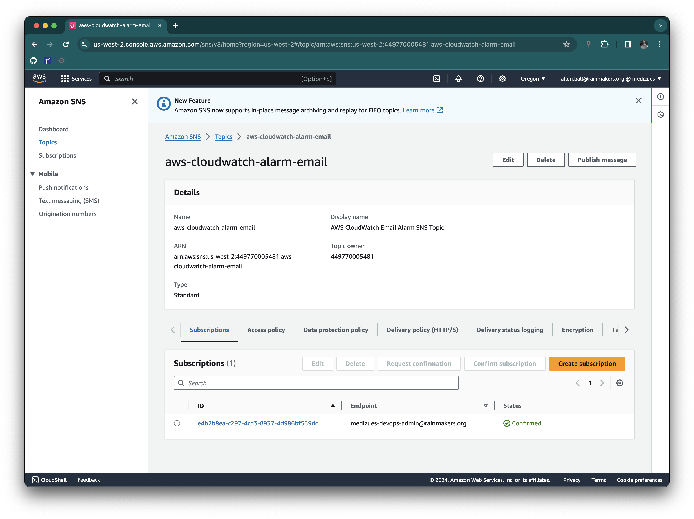
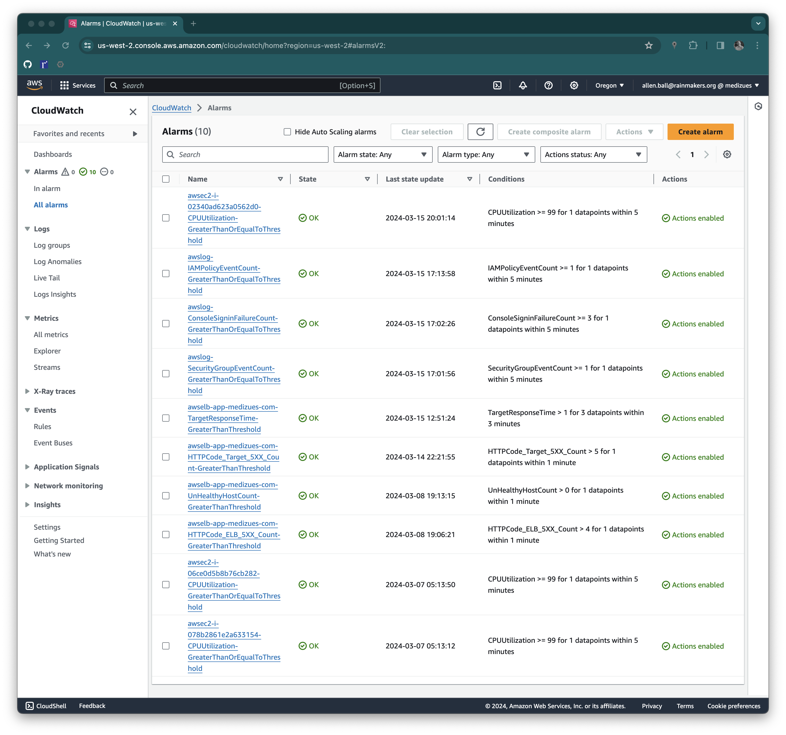
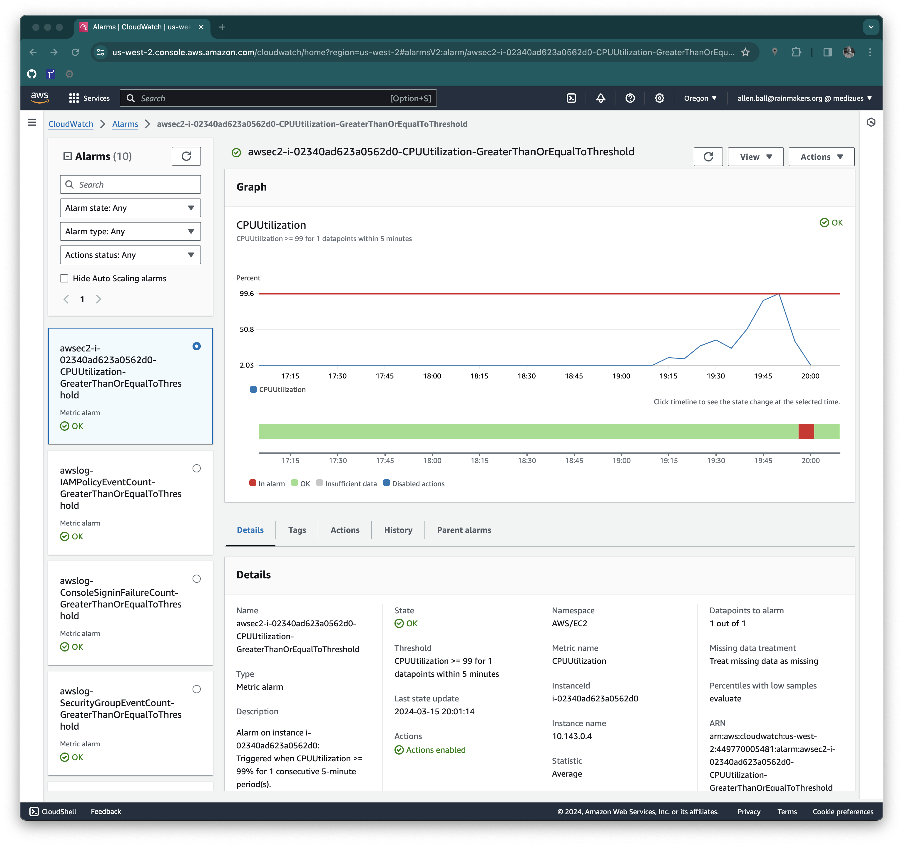
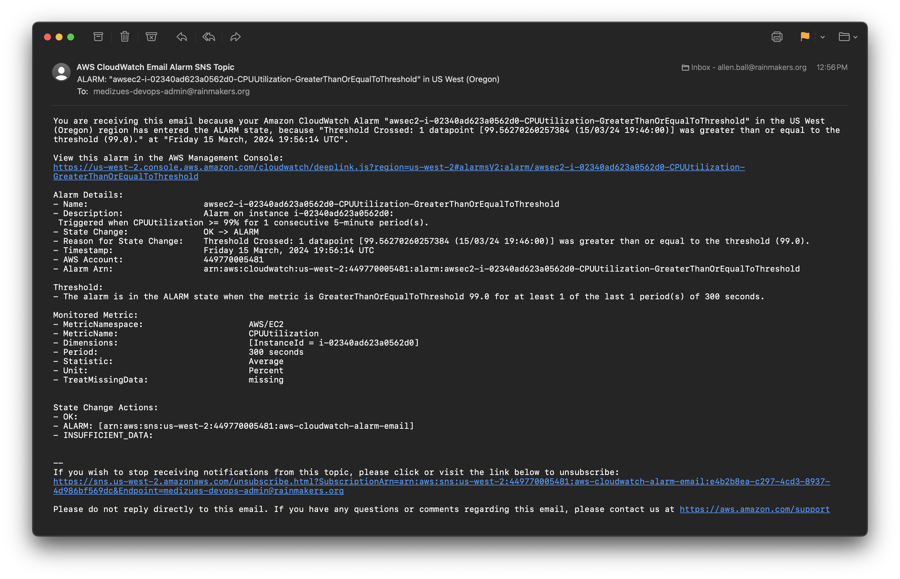

# Enabled Automated Log Alerting

~~~admonish info
This document provides the screenshots automated alert configurations in AWS.
~~~

E'mail notifications are delivered through an AWS SNS topic:

CloudWatch alarms are configured for critical metrics:

Example alarm:

With the corresponding e'mail message:

Complete configuration is available in the GitHub Ansible IaC repository
<https://github.com/Zues-Software-Inc/medizues-cloud> (refer to
[roles/aws-cloudwatch-alarms/vars/main.yml](https://github.com/Zues-Software-Inc/medizues-cloud/blob/trunk/roles/aws-cloudwatch-alarms/vars/main.yml)
and
[roles/aws-cloudwatch-alarms/tasks/main.yml](https://github.com/Zues-Software-Inc/medizues-cloud/blob/trunk/roles/aws-cloudwatch-alarms/tasks/main.yml)).
