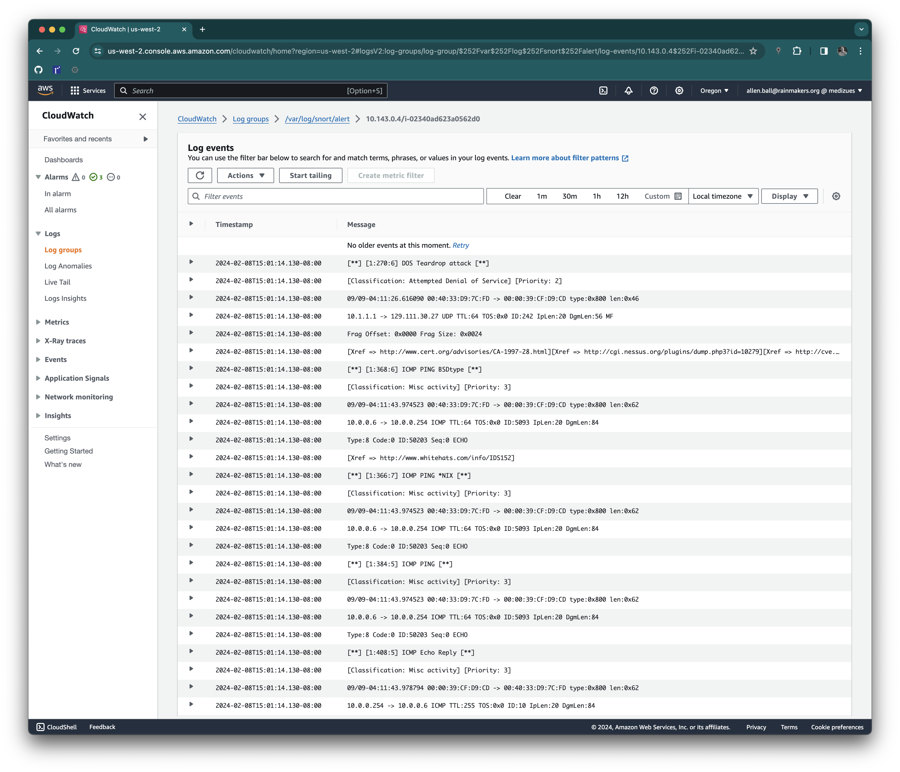

# Intrusion Detection System Installation

~~~admonish info
Solution:

1. Deploy `snort` on all AWS EC2 instances
2. Collect `snort` logs, including `/var/log/snort/alert`, to CloudWatch
~~~

## Ansible Installation Fragment

```yml
- name: install
  block:
    - name: debconf snort
      ansible.builtin.debconf:
        name: snort
        question: snort/address_range
        vtyoe: string
        value: "{{ [ipv4.network, ipv4.netmask] | join('/') | ansible.utils.ipaddr('net') }}"
    - name: install snort
      ansible.builtin.package:
        name:
          - snort
        state: latest
      notify: [ 'restart snort' ]

- name: snort
  ansible.builtin.user:
    name: snort
  register: snort

- name: start snort
  service: name=snort enabled=yes state=started
```

Further, the Amazon CloudWatch Agent is configured to collect the
`/var/log/snort/alert` and `/var/log/snort/snort.log` files to AWS Log Groups
with the same name.  The `/var/log/snort/alert` log group is monitored for
alerts.


## Test with Screenshot

To test the configuration, network trafic capture files containing known
attacks were downloaded from
<https://wiki.wireshark.org/SampleCaptures#Other_Sources_of_Capture_Files> and
processed on a development EC2 instance with:

```bash,hidelines=!
$ ssh 10.143.0.4
Last login: Thu Feb  8 21:58:21 2024 from 10.4.0.4
ubuntu@ip-10-143-0-4:~$ sudo snort -vde -c /etc/snort/snort.conf -l /var/log/snort -r teardrop.cap -K ascii
Running in IDS mode

        --== Initializing Snort ==--
Initializing Output Plugins!
Initializing Preprocessors!
Initializing Plug-ins!
Parsing Rules file "/etc/snort/snort.conf"
PortVar 'HTTP_PORTS' defined :  [ 80:81 311 383 591 593 901 1220 1414 1741 1830 2301 2381 2809 3037 3128 3702 4343 4848 5250 6988 7000:7001 7144:7145 7510 7777 7779 8000 8008 8014 8028 8080 8085 8088 8090 8118 8123 8180:8181 8243 8280 8300 8800 8888 8899 9000 9060 9080 9090:9091 9443 9999 11371 34443:34444 41080 50002 55555 ]
PortVar 'SHELLCODE_PORTS' defined :  [ 0:79 81:65535 ]
PortVar 'ORACLE_PORTS' defined :  [ 1024:65535 ]
PortVar 'SSH_PORTS' defined :  [ 22 ]
PortVar 'FTP_PORTS' defined :  [ 21 2100 3535 ]
PortVar 'SIP_PORTS' defined :  [ 5060:5061 5600 ]
PortVar 'FILE_DATA_PORTS' defined :  [ 80:81 110 143 311 383 591 593 901 1220 1414 1741 1830 2301 2381 2809 3037 3128 3702 4343 4848 5250 6988 7000:7001 7144:7145 7510 7777 7779 8000 8008 8014 8028 8080 8085 8088 8090 8118 8123 8180:8181 8243 8280 8300 8800 8888 8899 9000 9060 9080 9090:9091 9443 9999 11371 34443:34444 41080 50002 55555 ]
PortVar 'GTP_PORTS' defined :  [ 2123 2152 3386 ]
!Detection:
!   Search-Method = AC-Full-Q
!    Split Any/Any group = enabled
!    Search-Method-Optimizations = enabled
!    Maximum pattern length = 20
!Tagged Packet Limit: 256
!Loading dynamic engine /usr/lib/snort_dynamicengine/libsf_engine.so... done
!Loading all dynamic detection libs from /usr/lib/snort_dynamicrules...
!WARNING: No dynamic libraries found in directory /usr/lib/snort_dynamicrules.
!  Finished Loading all dynamic detection libs from /usr/lib/snort_dynamicrules
!Loading all dynamic preprocessor libs from /usr/lib/snort_dynamicpreprocessor/...
!  Loading dynamic preprocessor library /usr/lib/snort_dynamicpreprocessor//libsf_ssh_preproc.so... done
!  Loading dynamic preprocessor library /usr/lib/snort_dynamicpreprocessor//libsf_reputation_preproc.so... done
!  Loading dynamic preprocessor library /usr/lib/snort_dynamicpreprocessor//libsf_smtp_preproc.so... done
!  Loading dynamic preprocessor library /usr/lib/snort_dynamicpreprocessor//libsf_modbus_preproc.so... done
!  Loading dynamic preprocessor library /usr/lib/snort_dynamicpreprocessor//libsf_sdf_preproc.so... done
!  Loading dynamic preprocessor library /usr/lib/snort_dynamicpreprocessor//libsf_dns_preproc.so... done
!  Loading dynamic preprocessor library /usr/lib/snort_dynamicpreprocessor//libsf_imap_preproc.so... done
!  Loading dynamic preprocessor library /usr/lib/snort_dynamicpreprocessor//libsf_sip_preproc.so... done
!  Loading dynamic preprocessor library /usr/lib/snort_dynamicpreprocessor//libsf_pop_preproc.so... done
!  Loading dynamic preprocessor library /usr/lib/snort_dynamicpreprocessor//libsf_dnp3_preproc.so... done
!  Loading dynamic preprocessor library /usr/lib/snort_dynamicpreprocessor//libsf_ftptelnet_preproc.so... done
!  Loading dynamic preprocessor library /usr/lib/snort_dynamicpreprocessor//libsf_gtp_preproc.so... done
!  Loading dynamic preprocessor library /usr/lib/snort_dynamicpreprocessor//libsf_dce2_preproc.so... done
!  Loading dynamic preprocessor library /usr/lib/snort_dynamicpreprocessor//libsf_ssl_preproc.so... done
!  Finished Loading all dynamic preprocessor libs from /usr/lib/snort_dynamicpreprocessor/
!Log directory = /var/log/snort
!WARNING: ip4 normalizations disabled because not inline.
!WARNING: tcp normalizations disabled because not inline.
!WARNING: icmp4 normalizations disabled because not inline.
!WARNING: ip6 normalizations disabled because not inline.
!WARNING: icmp6 normalizations disabled because not inline.
!Frag3 global config:
!    Max frags: 65536
!    Fragment memory cap: 4194304 bytes
!Frag3 engine config:
!    Bound Address: default
!    Target-based policy: WINDOWS
!    Fragment timeout: 180 seconds
!    Fragment min_ttl:   1
!    Fragment Anomalies: Alert
!    Overlap Limit:     10
!    Min fragment Length:     100
!      Max Expected Streams: 768
!Stream global config:
!    Track TCP sessions: ACTIVE
!    Max TCP sessions: 262144
!    TCP cache pruning timeout: 30 seconds
!    TCP cache nominal timeout: 3600 seconds
!    Memcap (for reassembly packet storage): 8388608
!    Track UDP sessions: ACTIVE
!    Max UDP sessions: 131072
!    UDP cache pruning timeout: 30 seconds
!    UDP cache nominal timeout: 180 seconds
!    Track ICMP sessions: INACTIVE
!    Track IP sessions: INACTIVE
!    Log info if session memory consumption exceeds 1048576
!    Send up to 2 active responses
!    Wait at least 5 seconds between responses
!    Protocol Aware Flushing: ACTIVE
!        Maximum Flush Point: 16000
!Stream TCP Policy config:
!    Bound Address: default
!    Reassembly Policy: WINDOWS
!    Timeout: 180 seconds
!    Limit on TCP Overlaps: 10
!    Maximum number of bytes to queue per session: 1048576
!    Maximum number of segs to queue per session: 2621
!    Options:
!        Require 3-Way Handshake: YES
!        3-Way Handshake Timeout: 180
!        Detect Anomalies: YES
!    Reassembly Ports:
!      21 client (Footprint)
!      22 client (Footprint)
!      23 client (Footprint)
!      25 client (Footprint)
!      42 client (Footprint)
!      53 client (Footprint)
!      79 client (Footprint)
!      80 client (Footprint) server (Footprint)
!      81 client (Footprint) server (Footprint)
!      109 client (Footprint)
!      110 client (Footprint)
!      111 client (Footprint)
!      113 client (Footprint)
!      119 client (Footprint)
!      135 client (Footprint)
!      136 client (Footprint)
!      137 client (Footprint)
!      139 client (Footprint)
!      143 client (Footprint)
!      161 client (Footprint)
!      additional ports configured but not printed.
!Stream UDP Policy config:
!    Timeout: 180 seconds
!HttpInspect Config:
!    GLOBAL CONFIG
!      Detect Proxy Usage:       NO
!      IIS Unicode Map Filename: /etc/snort/unicode.map
!      IIS Unicode Map Codepage: 1252
!      Memcap used for logging URI and Hostname: 150994944
!      Max Gzip Memory: 104857600
!      Max Gzip Sessions: 201649
!      Gzip Compress Depth: 65535
!      Gzip Decompress Depth: 65535
!    DEFAULT SERVER CONFIG:
!      Server profile: All
!      Ports (PAF): 80 81 311 383 591 593 901 1220 1414 1741 1830 2301 2381 2809 3037 3128 3702 4343 4848 5250 6988 7000 7001 7144 7145 7510 7777 7779 8000 8008 8014 8028 8080 8085 8088 8090 8118 8123 8180 8181 8243 8280 8300 8800 8888 8899 9000 9060 9080 9090 9091 9443 9999 11371 34443 34444 41080 50002 55555
!      Server Flow Depth: 0
!      Client Flow Depth: 0
!      Max Chunk Length: 500000
!      Small Chunk Length Evasion: chunk size <= 10, threshold >= 5 times
!      Max Header Field Length: 750
!      Max Number Header Fields: 100
!      Max Number of WhiteSpaces allowed with header folding: 200
!      Inspect Pipeline Requests: YES
!      URI Discovery Strict Mode: NO
!      Allow Proxy Usage: NO
!      Disable Alerting: NO
!      Oversize Dir Length: 500
!      Only inspect URI: NO
!      Normalize HTTP Headers: NO
!      Inspect HTTP Cookies: YES
!      Inspect HTTP Responses: YES
!      Extract Gzip from responses: YES
!      Decompress response files:
!      Unlimited decompression of gzip data from responses: YES
!      Normalize Javascripts in HTTP Responses: YES
!      Max Number of WhiteSpaces allowed with Javascript Obfuscation in HTTP responses: 200
!      Normalize HTTP Cookies: NO
!      Enable XFF and True Client IP: NO
!      Log HTTP URI data: NO
!      Log HTTP Hostname data: NO
!      Extended ASCII code support in URI: NO
!      Ascii: YES alert: NO
!      Double Decoding: YES alert: NO
!      %U Encoding: YES alert: YES
!      Bare Byte: YES alert: NO
!      UTF 8: YES alert: NO
!      IIS Unicode: YES alert: NO
!      Multiple Slash: YES alert: NO
!      IIS Backslash: YES alert: NO
!      Directory Traversal: YES alert: NO
!      Web Root Traversal: YES alert: NO
!      Apache WhiteSpace: YES alert: NO
!      IIS Delimiter: YES alert: NO
!      IIS Unicode Map: GLOBAL IIS UNICODE MAP CONFIG
!      Non-RFC Compliant Characters: 0x00 0x01 0x02 0x03 0x04 0x05 0x06 0x07
!      Whitespace Characters: 0x09 0x0b 0x0c 0x0d
!rpc_decode arguments:
!    Ports to decode RPC on: 111 32770 32771 32772 32773 32774 32775 32776 32777 32778 32779
!    alert_fragments: INACTIVE
!    alert_large_fragments: INACTIVE
!    alert_incomplete: INACTIVE
!    alert_multiple_requests: INACTIVE
!FTPTelnet Config:
!    GLOBAL CONFIG
!      Inspection Type: stateful
!      Check for Encrypted Traffic: YES alert: NO
!      Continue to check encrypted data: YES
!    TELNET CONFIG:
!      Ports: 23
!      Are You There Threshold: 20
!      Normalize: YES
!      Detect Anomalies: YES
!    FTP CONFIG:
!      FTP Server: default
!        Ports (PAF): 21 2100 3535
!        Check for Telnet Cmds: YES alert: YES
!        Ignore Telnet Cmd Operations: YES alert: YES
!        Ignore open data channels: NO
!      FTP Client: default
!        Check for Bounce Attacks: YES alert: YES
!        Check for Telnet Cmds: YES alert: YES
!        Ignore Telnet Cmd Operations: YES alert: YES
!        Max Response Length: 256
!SMTP Config:
!    Ports: 25 465 587 691
!    Inspection Type: Stateful
!    Normalize: ATRN AUTH BDAT DATA DEBUG EHLO EMAL ESAM ESND ESOM ETRN EVFY EXPN HELO HELP IDENT MAIL NOOP ONEX QUEU QUIT RCPT RSET SAML SEND STARTTLS SOML TICK TIME TURN TURNME VERB VRFY X-EXPS XADR XAUTH XCIR XEXCH50 XGEN XLICENSE X-LINK2STATE XQUE XSTA XTRN XUSR CHUNKING X-ADAT X-DRCP X-ERCP X-EXCH50
!    Ignore Data: No
!    Ignore TLS Data: No
!    Ignore SMTP Alerts: No
!    Max Command Line Length: 512
!    Max Specific Command Line Length:
!       ATRN:255 AUTH:246 BDAT:255 DATA:246 DEBUG:255
!       EHLO:500 EMAL:255 ESAM:255 ESND:255 ESOM:255
!       ETRN:246 EVFY:255 EXPN:255 HELO:500 HELP:500
!       IDENT:255 MAIL:260 NOOP:255 ONEX:246 QUEU:246
!       QUIT:246 RCPT:300 RSET:246 SAML:246 SEND:246
!       SIZE:255 STARTTLS:246 SOML:246 TICK:246 TIME:246
!       TURN:246 TURNME:246 VERB:246 VRFY:255 X-EXPS:246
!       XADR:246 XAUTH:246 XCIR:246 XEXCH50:246 XGEN:246
!       XLICENSE:246 X-LINK2STATE:246 XQUE:246 XSTA:246 XTRN:246
!       XUSR:246
!    Max Header Line Length: 1000
!    Max Response Line Length: 512
!    X-Link2State Alert: Yes
!    Drop on X-Link2State Alert: No
!    Alert on commands: None
!    Alert on unknown commands: No
!    SMTP Memcap: 838860
!    MIME Max Mem: 838860
!    Base64 Decoding: Enabled
!    Base64 Decoding Depth: Unlimited
!    Quoted-Printable Decoding: Enabled
!    Quoted-Printable Decoding Depth: Unlimited
!    Unix-to-Unix Decoding: Enabled
!    Unix-to-Unix Decoding Depth: Unlimited
!    Non-Encoded MIME attachment Extraction: Enabled
!    Non-Encoded MIME attachment Extraction Depth: Unlimited
!    Log Attachment filename: Enabled
!    Log MAIL FROM Address: Enabled
!    Log RCPT TO Addresses: Enabled
!    Log Email Headers: Enabled
!    Email Hdrs Log Depth: 1464
!SSH config:
!    Autodetection: ENABLED
!    Challenge-Response Overflow Alert: ENABLED
!    SSH1 CRC32 Alert: ENABLED
!    Server Version String Overflow Alert: ENABLED
!    Protocol Mismatch Alert: ENABLED
!    Bad Message Direction Alert: DISABLED
!    Bad Payload Size Alert: DISABLED
!    Unrecognized Version Alert: DISABLED
!    Max Encrypted Packets: 20
!    Max Server Version String Length: 100
!    MaxClientBytes: 19600 (Default)
!    Ports:
!	22
!DCE/RPC 2 Preprocessor Configuration
!  Global Configuration
!    DCE/RPC Defragmentation: Enabled
!    Memcap: 102400 KB
!    Events: co
!    SMB Fingerprint policy: Disabled
!  Server Default Configuration
!    Policy: WinXP
!    Detect ports (PAF)
!      SMB: 139 445
!      TCP: 135
!      UDP: 135
!      RPC over HTTP server: 593
!      RPC over HTTP proxy: None
!    Autodetect ports (PAF)
!      SMB: None
!      TCP: 1025-65535
!      UDP: 1025-65535
!      RPC over HTTP server: 1025-65535
!      RPC over HTTP proxy: None
!    Invalid SMB shares: C$ D$ ADMIN$
!    Maximum SMB command chaining: 3 commands
!    SMB file inspection: Disabled
!DNS config:
!    DNS Client rdata txt Overflow Alert: ACTIVE
!    Obsolete DNS RR Types Alert: INACTIVE
!    Experimental DNS RR Types Alert: INACTIVE
!    Ports: 53
!SSLPP config:
!    Encrypted packets: not inspected
!    Ports:
!      443      465      563      636      989
!      992      993      994      995     7801
!     7802     7900     7901     7902     7903
!     7904     7905     7906     7907     7908
!     7909     7910     7911     7912     7913
!     7914     7915     7916     7917     7918
!     7919     7920
!    Server side data is trusted
!    Maximum SSL Heartbeat length: 0
!Sensitive Data preprocessor config:
!    Global Alert Threshold: 25
!    Masked Output: DISABLED
!SIP config:
!    Max number of sessions: 40000
!    Max number of dialogs in a session: 4 (Default)
!    Status: ENABLED
!    Ignore media channel: DISABLED
!    Max URI length: 512
!    Max Call ID length: 80
!    Max Request name length: 20 (Default)
!    Max From length: 256 (Default)
!    Max To length: 256 (Default)
!    Max Via length: 1024 (Default)
!    Max Contact length: 512
!    Max Content length: 2048
!    Ports:
!	5060	5061	5600
!    Methods:
!	  invite cancel ack bye register options refer subscribe update join info message notify benotify do qauth sprack publish service unsubscribe prack
!IMAP Config:
!    Ports: 143
!    IMAP Memcap: 838860
!    MIME Max Mem: 838860
!    Base64 Decoding: Enabled
!    Base64 Decoding Depth: Unlimited
!    Quoted-Printable Decoding: Enabled
!    Quoted-Printable Decoding Depth: Unlimited
!    Unix-to-Unix Decoding: Enabled
!    Unix-to-Unix Decoding Depth: Unlimited
!    Non-Encoded MIME attachment Extraction: Enabled
!    Non-Encoded MIME attachment Extraction Depth: Unlimited
!POP Config:
!    Ports: 110
!    POP Memcap: 838860
!    MIME Max Mem: 838860
!    Base64 Decoding: Enabled
!    Base64 Decoding Depth: Unlimited
!    Quoted-Printable Decoding: Enabled
!    Quoted-Printable Decoding Depth: Unlimited
!    Unix-to-Unix Decoding: Enabled
!    Unix-to-Unix Decoding Depth: Unlimited
!    Non-Encoded MIME attachment Extraction: Enabled
!    Non-Encoded MIME attachment Extraction Depth: Unlimited
!Modbus config:
!    Ports:
!	502
!DNP3 config:
!    Memcap: 262144
!    Check Link-Layer CRCs: ENABLED
!    Ports:
!	20000
!
!+++++++++++++++++++++++++++++++++++++++++++++++++++
!Initializing rule chains...
!WARNING: /etc/snort/rules/chat.rules(33) threshold (in rule) is deprecated; use detection_filter instead.
!
!WARNING: /etc/snort/rules/community-sql-injection.rules(6) GID 1 SID 100000106 in rule duplicates previous rule. Ignoring old rule.
!
!...
!
!WARNING: /etc/snort/rules/community-web-php.rules(474) GID 1 SID 100000934 in rule duplicates previous rule. Ignoring old rule.
!
!4150 Snort rules read
!    3476 detection rules
!    0 decoder rules
!    0 preprocessor rules
!3476 Option Chains linked into 271 Chain Headers
!0 Dynamic rules
!+++++++++++++++++++++++++++++++++++++++++++++++++++
!
!+-------------------[Rule Port Counts]---------------------------------------
!|             tcp     udp    icmp      ip
!|     src     151      18       0       0
!|     dst    3306     126       0       0
!|     any     383      48     145      22
!|      nc      27       8      94      20
!|     s+d      12       5       0       0
!+----------------------------------------------------------------------------
!
!+-----------------------[detection-filter-config]------------------------------
!| memory-cap : 1048576 bytes
!+-----------------------[detection-filter-rules]-------------------------------
!| none
!-------------------------------------------------------------------------------
!
!+-----------------------[rate-filter-config]-----------------------------------
!| memory-cap : 1048576 bytes
!+-----------------------[rate-filter-rules]------------------------------------
!| none
!-------------------------------------------------------------------------------
!
!+-----------------------[event-filter-config]----------------------------------
!| memory-cap : 1048576 bytes
!+-----------------------[event-filter-global]----------------------------------
!| none
!+-----------------------[event-filter-local]-----------------------------------
!| gen-id=1      sig-id=2923       type=Threshold tracking=dst count=10  seconds=60
!| gen-id=1      sig-id=2494       type=Both      tracking=dst count=20  seconds=60
!| gen-id=1      sig-id=3273       type=Threshold tracking=src count=5   seconds=2
!| gen-id=1      sig-id=2496       type=Both      tracking=dst count=20  seconds=60
!| gen-id=1      sig-id=2495       type=Both      tracking=dst count=20  seconds=60
!| gen-id=1      sig-id=2924       type=Threshold tracking=dst count=10  seconds=60
!| gen-id=1      sig-id=2275       type=Threshold tracking=dst count=5   seconds=60
!| gen-id=1      sig-id=2523       type=Both      tracking=dst count=10  seconds=10
!| gen-id=1      sig-id=1991       type=Limit     tracking=src count=1   seconds=60
!| gen-id=1      sig-id=3152       type=Threshold tracking=src count=5   seconds=2
!+-----------------------[suppression]------------------------------------------
!| none
!-------------------------------------------------------------------------------
!Rule application order: activation->dynamic->pass->drop->sdrop->reject->alert->log
!Verifying Preprocessor Configurations!
!WARNING: flowbits key 'ms_sql_seen_dns' is checked but not ever set.
!WARNING: flowbits key 'smb.tree.create.llsrpc' is set but not ever checked.
!33 out of 1024 flowbits in use.
!
![ Port Based Pattern Matching Memory ]
!+- [ Aho-Corasick Summary ] -------------------------------------
!| Storage Format    : Full-Q
!| Finite Automaton  : DFA
!| Alphabet Size     : 256 Chars
!| Sizeof State      : Variable (1,2,4 bytes)
!| Instances         : 215
!|     1 byte states : 204
!|     2 byte states : 11
!|     4 byte states : 0
!| Characters        : 64982
!| States            : 32135
!| Transitions       : 872051
!| State Density     : 10.6%
!| Patterns          : 5055
!| Match States      : 3855
!| Memory (MB)       : 17.00
!|   Patterns        : 0.51
!|   Match Lists     : 1.02
!|   DFA
!|     1 byte states : 1.02
!|     2 byte states : 14.05
!|     4 byte states : 0.00
!+----------------------------------------------------------------
![ Number of patterns truncated to 20 bytes: 1039 ]
!pcap DAQ configured to read-file.
!Acquiring network traffic from "teardrop.cap".
!Reload thread starting...
!Reload thread started, thread 0x7fefe689d700 (52422)
!WARNING: active responses disabled since DAQ can't inject packets.
!
!        --== Initialization Complete ==--
!
!   ,,_     -*> Snort! <*-
!  o"  )~   Version 2.9.7.0 GRE (Build 149)
!   ''''    By Martin Roesch & The Snort Team: http://www.snort.org/contact#team
!           Copyright (C) 2014 Cisco and/or its affiliates. All rights reserved.
!           Copyright (C) 1998-2013 Sourcefire, Inc., et al.
!           Using libpcap version 1.9.1 (with TPACKET_V3)
!           Using PCRE version: 8.39 2016-06-14
!           Using ZLIB version: 1.2.11
!
!           Rules Engine: SF_SNORT_DETECTION_ENGINE  Version 2.4  <Build 1>
!           Preprocessor Object: SF_SSLPP  Version 1.1  <Build 4>
!           Preprocessor Object: SF_DCERPC2  Version 1.0  <Build 3>
!           Preprocessor Object: SF_GTP  Version 1.1  <Build 1>
!           Preprocessor Object: SF_FTPTELNET  Version 1.2  <Build 13>
!           Preprocessor Object: SF_DNP3  Version 1.1  <Build 1>
!           Preprocessor Object: SF_POP  Version 1.0  <Build 1>
!           Preprocessor Object: SF_SIP  Version 1.1  <Build 1>
!           Preprocessor Object: SF_IMAP  Version 1.0  <Build 1>
!           Preprocessor Object: SF_DNS  Version 1.1  <Build 4>
!           Preprocessor Object: SF_SDF  Version 1.1  <Build 1>
!           Preprocessor Object: SF_MODBUS  Version 1.1  <Build 1>
!           Preprocessor Object: SF_SMTP  Version 1.1  <Build 9>
!           Preprocessor Object: SF_REPUTATION  Version 1.1  <Build 1>
!           Preprocessor Object: SF_SSH  Version 1.1  <Build 3>
!Commencing packet processing (pid=52414)
!09/09-04:11:26.294020 00:40:33:D9:7C:FD -> 00:00:39:CF:D9:CD type:0x800 len:0x4E
!10.0.0.6:1035 -> 151.164.1.8:53 UDP TTL:64 TOS:0x0 ID:5092 IpLen:20 DgmLen:64
!Len: 36
!7D 9E 01 00 00 01 00 00 00 00 00 00 06 70 69 63  }............pic
!61 72 64 07 75 74 68 73 63 73 61 03 65 64 75 00  ard.uthscsa.edu.
!00 01 00 01                                      ....
!
!=+=+=+=+=+=+=+=+=+=+=+=+=+=+=+=+=+=+=+=+=+=+=+=+=+=+=+=+=+=+=+=+=+=+=+=+=+
!
!09/09-04:11:26.613908 00:00:39:CF:D9:CD -> 00:40:33:D9:7C:FD type:0x800 len:0x121
!151.164.1.8:53 -> 10.0.0.6:1035 UDP TTL:246 TOS:0x0 ID:40029 IpLen:20 DgmLen:275 DF
!Len: 247
!7D 9E 85 80 00 01 00 01 00 05 00 05 06 70 69 63  }............pic
!61 72 64 07 75 74 68 73 63 73 61 03 65 64 75 00  ard.uthscsa.edu.
!00 01 00 01 C0 0C 00 01 00 01 00 00 0E 10 00 04  ................
!81 6F 1E 1B 07 75 74 68 73 63 73 61 03 65 64 75  .o...uthscsa.edu
!00 00 02 00 01 00 00 0E 10 00 09 06 6B 65 6E 6F  ............keno
!62 69 C0 34 C0 34 00 02 00 01 00 00 0E 10 00 07  bi.4.4..........
!04 6A 69 6E 6E C0 34 C0 34 00 02 00 01 00 00 0E  .jinn.4.4.......
!10 00 0C 04 64 6E 73 31 04 6E 6A 69 74 C0 3C C0  ....dns1.njit.<.
!34 00 02 00 01 00 00 0E 10 00 08 05 65 6C 7A 69  4...........elzi
!70 C0 34 C0 34 00 02 00 01 00 00 0E 10 00 08 05  p.4.4...........
!61 72 77 65 6E C0 34 C0 4B 00 01 00 01 00 00 0E  arwen.4.K.......
!10 00 04 81 6F 1A 06 C0 60 00 01 00 01 00 00 0E  ....o...`.......
!10 00 04 81 6F 1A 07 C0 73 00 01 00 01 00 01 03  ....o...s.......
!82 00 04 80 EB FB 0A C0 8B 00 01 00 01 00 00 0E  ................
!10 00 04 81 6F 01 0B C0 9F 00 01 00 01 00 00 0E  ....o...........
!10 00 04 81 6F 0B 51                             ....o.Q
!
!=+=+=+=+=+=+=+=+=+=+=+=+=+=+=+=+=+=+=+=+=+=+=+=+=+=+=+=+=+=+=+=+=+=+=+=+=+
!
!09/09-04:11:26.616445 00:40:33:D9:7C:FD -> 00:00:39:CF:D9:CD type:0x800 len:0x26
!10.1.1.1 -> 129.111.30.27 UDP TTL:64 TOS:0x0 ID:242 IpLen:20 DgmLen:24
!Frag Offset: 0x0003   Frag Size: 0x0004
!7C AB 4E E5                                      |.N.
!
!=+=+=+=+=+=+=+=+=+=+=+=+=+=+=+=+=+=+=+=+=+=+=+=+=+=+=+=+=+=+=+=+=+=+=+=+=+
!
!===============================================================================
!Run time for packet processing was 1.389 seconds
!Snort processed 17 packets.
!Snort ran for 0 days 0 hours 0 minutes 1 seconds
!   Pkts/sec:           17
!===============================================================================
!Memory usage summary:
!  Total non-mmapped bytes (arena):       46100480
!  Bytes in mapped regions (hblkhd):      13746176
!  Total allocated space (uordblks):      40492080
!  Total free space (fordblks):           5608400
!  Topmost releasable block (keepcost):   26784
!===============================================================================
!Packet I/O Totals:
!   Received:           17
!   Analyzed:           17 (100.000%)
!    Dropped:            0 (  0.000%)
!   Filtered:            0 (  0.000%)
!Outstanding:            0 (  0.000%)
!   Injected:            0
!===============================================================================
!Breakdown by protocol (includes rebuilt packets):
!        Eth:           17 (100.000%)
!       VLAN:            0 (  0.000%)
!        IP4:            6 ( 35.294%)
!       Frag:            2 ( 11.765%)
!       ICMP:            2 ( 11.765%)
!        UDP:            3 ( 17.647%)
!        TCP:            0 (  0.000%)
!        IP6:            0 (  0.000%)
!    IP6 Ext:            0 (  0.000%)
!   IP6 Opts:            0 (  0.000%)
!      Frag6:            0 (  0.000%)
!      ICMP6:            0 (  0.000%)
!       UDP6:            0 (  0.000%)
!       TCP6:            0 (  0.000%)
!     Teredo:            0 (  0.000%)
!    ICMP-IP:            0 (  0.000%)
!    IP4/IP4:            0 (  0.000%)
!    IP4/IP6:            0 (  0.000%)
!    IP6/IP4:            0 (  0.000%)
!    IP6/IP6:            0 (  0.000%)
!        GRE:            0 (  0.000%)
!    GRE Eth:            0 (  0.000%)
!   GRE VLAN:            0 (  0.000%)
!    GRE IP4:            0 (  0.000%)
!    GRE IP6:            0 (  0.000%)
!GRE IP6 Ext:            0 (  0.000%)
!   GRE PPTP:            0 (  0.000%)
!    GRE ARP:            0 (  0.000%)
!    GRE IPX:            0 (  0.000%)
!   GRE Loop:            0 (  0.000%)
!       MPLS:            0 (  0.000%)
!        ARP:            5 ( 29.412%)
!        IPX:            0 (  0.000%)
!   Eth Loop:            5 ( 29.412%)
!   Eth Disc:            0 (  0.000%)
!   IP4 Disc:            0 (  0.000%)
!   IP6 Disc:            0 (  0.000%)
!   TCP Disc:            0 (  0.000%)
!   UDP Disc:            0 (  0.000%)
!  ICMP Disc:            0 (  0.000%)
!All Discard:            0 (  0.000%)
!      Other:            1 (  5.882%)
!Bad Chk Sum:            0 (  0.000%)
!    Bad TTL:            0 (  0.000%)
!     S5 G 1:            0 (  0.000%)
!     S5 G 2:            0 (  0.000%)
!      Total:           17
!===============================================================================
!Action Stats:
!     Alerts:            5 ( 29.412%)
!     Logged:            5 ( 29.412%)
!     Passed:            0 (  0.000%)
!Limits:
!      Match:            0
!      Queue:            0
!        Log:            0
!      Event:            0
!      Alert:            0
!Verdicts:
!      Allow:           17 (100.000%)
!      Block:            0 (  0.000%)
!    Replace:            0 (  0.000%)
!  Whitelist:            0 (  0.000%)
!  Blacklist:            0 (  0.000%)
!     Ignore:            0 (  0.000%)
!      Retry:            0 (  0.000%)
!===============================================================================
!Frag3 statistics:
!        Total Fragments: 2
!      Frags Reassembled: 0
!               Discards: 1
!          Memory Faults: 0
!               Timeouts: 0
!               Overlaps: 1
!              Anomalies: 2
!                 Alerts: 2
!                  Drops: 0
!     FragTrackers Added: 1
!    FragTrackers Dumped: 1
!FragTrackers Auto Freed: 0
!    Frag Nodes Inserted: 1
!     Frag Nodes Deleted: 1
!===============================================================================
!===============================================================================
!Stream statistics:
!            Total sessions: 1
!              TCP sessions: 0
!              UDP sessions: 1
!             ICMP sessions: 0
!               IP sessions: 0
!                TCP Prunes: 0
!                UDP Prunes: 0
!               ICMP Prunes: 0
!                 IP Prunes: 0
!TCP StreamTrackers Created: 0
!TCP StreamTrackers Deleted: 0
!              TCP Timeouts: 0
!              TCP Overlaps: 0
!       TCP Segments Queued: 0
!     TCP Segments Released: 0
!       TCP Rebuilt Packets: 0
!         TCP Segments Used: 0
!              TCP Discards: 0
!                  TCP Gaps: 0
!      UDP Sessions Created: 1
!      UDP Sessions Deleted: 1
!              UDP Timeouts: 0
!              UDP Discards: 0
!                    Events: 0
!           Internal Events: 0
!           TCP Port Filter
!                  Filtered: 0
!                 Inspected: 0
!                   Tracked: 0
!           UDP Port Filter
!                  Filtered: 0
!                 Inspected: 0
!                   Tracked: 1
!===============================================================================
!===============================================================================
!SMTP Preprocessor Statistics
!  Total sessions                                    : 0
!  Max concurrent sessions                           : 0
!===============================================================================
!dcerpc2 Preprocessor Statistics
!  Total sessions: 0
!===============================================================================
!===============================================================================
!SIP Preprocessor Statistics
!  Total sessions: 0
!===============================================================================
...
Snort exiting
```
```bash
ubuntu@ip-10-143-0-4:~$ cat /var/log/snort/alert
[**] [1:270:6] DOS Teardrop attack [**]
[Classification: Attempted Denial of Service] [Priority: 2]
09/09-04:11:26.616090 00:40:33:D9:7C:FD -> 00:00:39:CF:D9:CD type:0x800 len:0x46
10.1.1.1 -> 129.111.30.27 UDP TTL:64 TOS:0x0 ID:242 IpLen:20 DgmLen:56 MF
Frag Offset: 0x0000   Frag Size: 0x0024
[Xref => http://www.cert.org/advisories/CA-1997-28.html][Xref => http://cgi.nessus.org/plugins/dump.php3?id=10279][Xref => http://cve.mitre.org/cgi-bin/cvename.cgi?name=1999-0015][Xref => http://www.securityfocus.com/bid/124]

[**] [1:368:6] ICMP PING BSDtype [**]
[Classification: Misc activity] [Priority: 3]
09/09-04:11:43.974523 00:40:33:D9:7C:FD -> 00:00:39:CF:D9:CD type:0x800 len:0x62
10.0.0.6 -> 10.0.0.254 ICMP TTL:64 TOS:0x0 ID:5093 IpLen:20 DgmLen:84
Type:8  Code:0  ID:50203   Seq:0  ECHO
[Xref => http://www.whitehats.com/info/IDS152]

[**] [1:366:7] ICMP PING *NIX [**]
[Classification: Misc activity] [Priority: 3]
09/09-04:11:43.974523 00:40:33:D9:7C:FD -> 00:00:39:CF:D9:CD type:0x800 len:0x62
10.0.0.6 -> 10.0.0.254 ICMP TTL:64 TOS:0x0 ID:5093 IpLen:20 DgmLen:84
Type:8  Code:0  ID:50203   Seq:0  ECHO

[**] [1:384:5] ICMP PING [**]
[Classification: Misc activity] [Priority: 3]
09/09-04:11:43.974523 00:40:33:D9:7C:FD -> 00:00:39:CF:D9:CD type:0x800 len:0x62
10.0.0.6 -> 10.0.0.254 ICMP TTL:64 TOS:0x0 ID:5093 IpLen:20 DgmLen:84
Type:8  Code:0  ID:50203   Seq:0  ECHO

[**] [1:408:5] ICMP Echo Reply [**]
[Classification: Misc activity] [Priority: 3]
09/09-04:11:43.978794 00:00:39:CF:D9:CD -> 00:40:33:D9:7C:FD type:0x800 len:0x62
10.0.0.254 -> 10.0.0.6 ICMP TTL:255 TOS:0x0 ID:10 IpLen:20 DgmLen:84
Type:0  Code:0  ID:50203  Seq:0  ECHO REPLY
```

The configuration detected the attack and logged the alert to CloudWatch:


