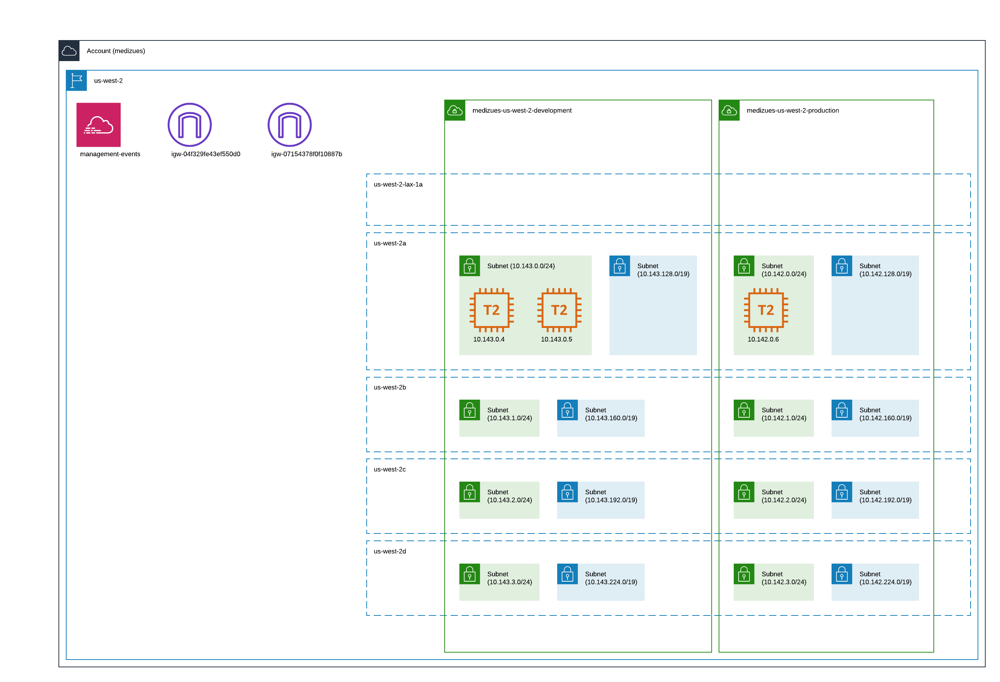

# Network Diagram

~~~admonish info
Development and staging are segregated from production by being separate VPCs.

Production MongoDB services are provided by MongoDB Atlas.

The MediZues configuration will be scaled as required by customer traffic and
this diagram will be updated accordingly.
~~~

