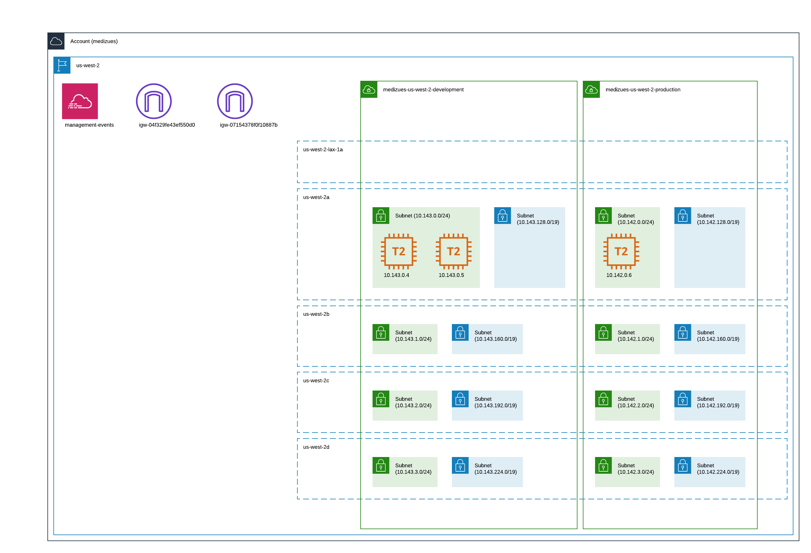

# Network Segregation

~~~admonish info
Development and staging are segregated from production by being separate VPCs.

"Public" and "private" subnets are configured in each availability zone for
planned scaling of the solution.
~~~

