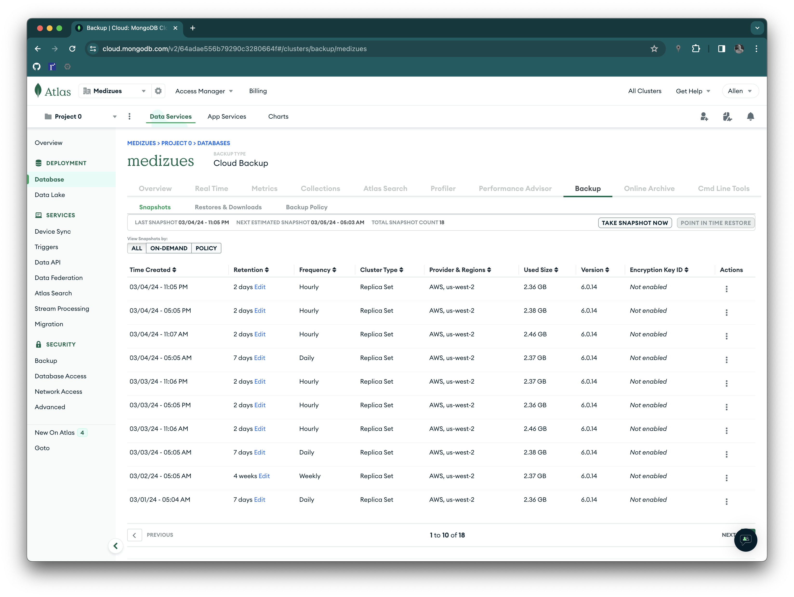

# Tabletop Disaster Recovery Exercise

## Introduction

On February 29th, 2024 Allen Ball and Evan McGuffie participated in a Table
Top Disaster Recovery Exercise summarized in this document.

## Scenario

After a routine application update, users report that they cannot either login
to their MediZues application accounts or, if they can login, that their CRM
and program data are inconsistent.

It is quickly discovered that a `git` commit with "hardwired" MongoDB Atlas
development credentials was inadvertently included in the last production push
causing producton to use the development environment for some database
actions.

## Response

The head of DevOps, Allen Ball, has the authority to activate the Business
Continuity and Disaster Recovery Plan.  The Plan may be activated as a result
of an escalation to any executive management.

The incident response consists of the following high-level steps:

1. Take the site offline

2. Rollback to a known good state

3. Postmortem

4. Re-apply application update

5. Continuous improvement

A single DevOps engineer can complete steps #1 and #2.  The site is taken
offline by removing the CNAME records for app.medizues.com and
adm.medizues.com.[^1]

Rolling back to a known good state requires both restoring the production
Atlas MongoDB database to the last back-up before the update and restoring the
application on the EC2 instances.  The database restore is run from the Atlas
web app:

As far as restoring the application code and EC2 instances, the DevOps
engineer may either rely on AWS Backup to restore the back-ups or rebuild
using the Ansible IaC maintained in
<https://github.com/Zues-Software-Inc/medizues-cloud>.  For this exercise,
rebuilding from IaC is the expedient choice.

The incident "postmortem" includes:

* Failure in process in that peer review did not prevent adding the "debug"
  code to the production branch

* The application could be improved to detect database misconfiguraton and
  "fail fast" at deployment

Outside the incident response but still critical is to take the above
"postmortem" and re-apply the application update.

Finally, staff will execute on the findings for continuous improvement.

## Findings

Summary of findings:

* The MediZues app needs a static "under maintenance" web site that may be set
  as the target of app.medizues.com and adm.medizues.com during incidents

* GitHub checks such as scanning for credentials happen asynchronously; these
  checks should be run before deploying code to production

* Peer review processes should include synchronous tools for credential scans
  and other security checks

## Debrief/Hotwash Questions

An after action report identifying strengths and areas where improvements
might be made will be provided after the exercise. The following questions are
designed to obtain input into the after action report from participants.

> Are there any other issues you would like to discuss that were not raised?

`[Allen]` None

> What are the strengths of the contingency plan? What areas require closer
> examination?

`[Allen]` Our plan is robust for system recovery with multiply back-up and
restore strategies.  However, we need to improve communications to the user
base during an incident.

> Was the exercise beneficial? Did it help prepare you for follow-up testing?

`[Allen]` Yes

> What did you gain from the exercise?

`[Allen]` Highlighting the gap in not notifying users during maintenance events.

> How can we improve future exercises and tests?

`[Allen]` Examine other types of disasters such as DDoS attacks.

[^1]: This process may be improved by creating a static website that will
    inform MediZues users that the site is under maintenance.
